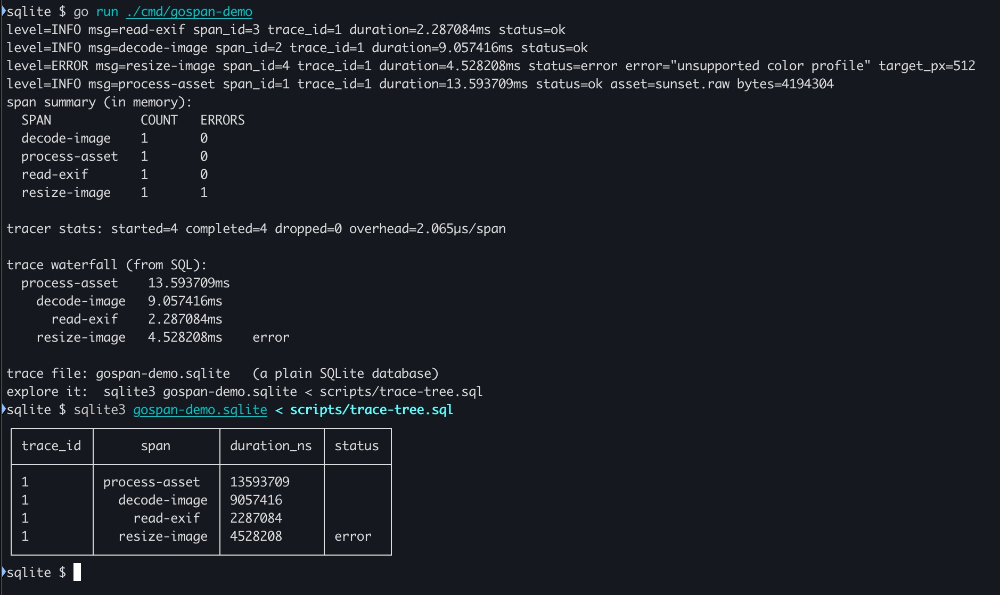

# gospan

*Embedded span tracing for Go. Zero-dependency core; spans to your slog logger or a queryable SQLite file.*

[](https://pkg.go.dev/github.com/akmadian/gospan)
[](https://goreportcard.com/report/github.com/akmadian/gospan)
[](https://github.com/akmadian/gospan/actions/workflows/ci.yml)
[](LICENSE)

[Quickstart](#quickstart) · [Overhead](#overhead) · [Guarantees](#guarantees) · [Configuration](#configuration) · [FAQ](#faq)

gospan shows you where a Go program spends its time. Wrap the slow-looking parts in named spans; they nest through the `context.Context` you already pass around. Send them to your **slog logger** to watch live, or to a **SQLite file** you query with plain SQL when the run ends. It's in-process tracing — no collector, no agent, no CGO — cheap enough (two allocations per span) to leave in.



> **Pre-1.0.** The file format (SPEC §3–§5) is a frozen, cross-version contract; the Go API may still shift before 1.0. Implemented, tested, and validated in Alexandria, a real import pipeline. Testers and contributions welcome — help me find where it falls short. Common questions ("isn't this just OpenTelemetry?", overload behavior, why SQLite) are in the [FAQ](#faq).

## Why

Logs tell you what happened, not where the time went. Metrics need a server. `go tool trace` shows the Go scheduler, not your code. OpenTelemetry is built for tracing *across services* — overkill when one program is slow and you just want to know why. gospan fills that gap: name the operations you care about and read their timing right where you already look.

Good for anything with a start and an end — request latency (which nested query ate the time), pipeline backpressure (the wait on a full worker pool *is* the span), batch-job stages, or a one-line wrapper around an `ffmpeg`/`git` exec.

<a name="quickstart"></a>

## Quickstart

```sh
go get github.com/akmadian/gospan
```

Core is stdlib-only. Hand it your logger — every maintained Go logging library is or bridges to a `slog.Handler` — and spans arrive as structured log lines with durations:

```go
func main() {
    tracer, err := gospan.New(gospan.SlogSink(slog.Default()))
    if err != nil { /* construction is the only moment gospan can fail */ }
    defer tracer.Close(context.Background())
    gospan.SetDefault(tracer)
    // ...
}

func handleReport(ctx context.Context, req Request) error {
    ctx, span := gospan.Start(ctx, "build-report", slog.String("user", req.User))
    defer span.End()

    data, err := loadRows(ctx, req) // loadRows' own spans nest via ctx
    if err != nil {
        span.Fail(err) // status = error, or canceled when errors.Is says so
        return err
    }
    return render(ctx, data)
}

func render(ctx context.Context, data Rows) error {
    defer gospan.Track(ctx, "render-pdf")() // one-line leaf span
    // ...
}
```

`Start` returns a span and a context carrying it; anything started from that context nests beneath. `End` stamps the duration and hands the span to a bounded buffer that a single background goroutine drains to the destination — your code never touches the sink.

### Trace to a SQLite file

```sh
go get github.com/akmadian/gospan/sqlite
```

The SQLite sink (pure Go, no CGO) writes one auto-named file per run. When the run ends it's plain SQLite — the built-in `spans_named` view resolves the name join and duration for you:

```go
sink, err := sqlite.New("./traces")
if err != nil { /* same rule: errors only at construction */ }
tracer, err := gospan.New(sink)
```

```sql
-- worst durations by span name
SELECT name, COUNT(*), MAX(duration_ns) AS worst_ns
FROM spans_named
WHERE end_ns IS NOT NULL GROUP BY name ORDER BY worst_ns DESC;
```

Ready-made analysis queries — per-name percentiles, slowest spans, failure triage, effective parallelism — ship in [sqlite/scripts/](sqlite/scripts/):

```sh
sqlite3 ./traces/gospan-*.sqlite < sqlite/scripts/by-name.sql
```

### Both at once

Send every span to the file *and* the log flow with `MultiSink` — or make the file the sink and the logger just the complaints channel (`WithLogger`) to keep spans out of your logs:

```go
tracer, err := gospan.New(gospan.MultiSink(
    gospan.SlogSink(slog.Default()),
    sink,
))
```

### Live statistics

`Summary()` reports on your code; `Stats()` on the tracer itself — what tracing costs, what it dropped:

```go
report := tracer.Summary()["build-report"]
slog.Info("reports", "p90", report.P90, "count", report.Count, "errors", report.Errors)

health := tracer.Stats()
slog.Info("tracing itself", "dropped", health.Dropped, "cost", health.OverheadPerSpan)
```

> Span names must stay **low-cardinality** — a small, stable set. Put varying data (request IDs, paths) in attributes, not the name: `Summary()` keeps a fixed-size histogram per distinct name, so names carrying IDs would grow memory. gospan caps the tracked set and reports any excess in `Stats().SummaryDropped`.

## Patterns

The quickstart is the call-tree case: ctx flows down the stack, spans nest for free. Two more shapes cover most programs.

**Pipeline items** cross goroutines through channels, so the span rides the item, not the call stack:

```go
type pipelineItem struct {
    ctx context.Context // carries this item's root span
    // ...
}
// intake:      item.ctx, _ = gospan.Start(ctx, "job", slog.String("path", path))
// each stage:  _, span := gospan.Start(item.ctx, "hash"); defer span.End()
// final stage: gospan.FromContext(item.ctx).End()
```

**Waits** — the span *is* the wait, the numbers are attributes:

```go
_, wait := gospan.Start(ctx, "acquire-budget", slog.Int64("tokens", n))
err := sem.Acquire(ctx, n)
wait.End() // the duration IS the wait time
```

More recipes — subprocess leaves, fan-in batches — in [docs/DESIGN.md](docs/DESIGN.md) §6.

<a name="overhead"></a>

## Overhead

Measured on Apple M1, Go 1.26, medians of 5 runs. Allocation counts are deterministic (ns/op is not) and enforced as ceilings by the test suite, so they hold on every machine:

| hot-path op              | time    | allocs | bytes |
|--------------------------|---------|--------|-------|
| `Start` + `End`          | 361 ns  | 2      | 160 B |
| `Start` + `End`, 2 attrs | 393 ns  | 3      | 240 B |
| `Track` leaf             | 369 ns  | 2      | 160 B |
| `SetAttrs`               | 121 ns  | 1      | 48 B  |
| buffer full (dropping)   | 187 ns  | 2      | 160 B |
| nil tracer (off)         | 4.3 ns  | 0      | 0 B   |

Attributes cost one slice regardless of count. For context, the OpenTelemetry SDK (v1.44) on the same machine in its cheapest configuration (batch processor, discard exporter) costs **615 ns / 3 allocs / 944 B** for a bare span and **893 ns / 8 allocs / 1.4 KB** with two attributes — so a gospan span with attrs runs ~2.3× faster at a sixth of the memory, about the cost of 2.5 structured log lines.

These are hot-path microbenchmarks (single producer, discard sink, warm cache) — a floor, not a promise. Under real concurrent load expect low single-digit microseconds per span end to end; Alexandria's pipeline sees ~2µs. The write side (the SQLite commit) runs on gospan's goroutine, never yours: it sustains ~286k spans/sec coalesced, ~82k with four attrs each. Reproduce: `go test -bench . -benchmem ./...`.

<a name="guarantees"></a>

## Guarantees

gospan is built to leave in. All four of these are tested, not just claimed:

- **Can't crash your program.** Every public boundary recovers panics — including hostile ones (panicking sinks, loggers, and error types are in the test suite). gospan's own bugs never become yours.
- **Won't block you.** A full buffer drops the event and increments `Stats().Dropped` — your code never stalls beyond one channel send. Prefer to slow down rather than lose spans? `WithBlockingPolicy()`. Either way, loss is measured, never silent.
- **No errors after construction.** Disk failures, sick sinks — all degrade to drop-and-count, visible in `Stats()`. The only errors you handle are at `New`, the one moment a human can fix a bad path. A graceful `Close` loses nothing; a hard kill loses at most one flush interval (default 1s).
- **`nil` is off.** Every method on a nil `*Tracer`/`*Span` is a ~4ns, zero-alloc no-op that returns your context unchanged — so you gate *construction* on an env var and leave every call site in place.

And **zero-dependency core**: the tracer and slog output are pure stdlib — nothing in your `go.mod`. The SQLite file is one optional module (`gospan/sqlite`) using a pure-Go driver, so no CGO and no C compiler; its ~10 transitive modules land in your binary only if you import it.

## What it is — and isn't

**Is:** in-process span monitoring for anything with a start and an end, over a small three-method destination seam (the `slog.Handler` pattern) — slog and SQLite in-tree, anything heavier in its own module so no one's build pays for a destination they don't use.

**Isn't:** distributed tracing (no cross-process propagation — that's OpenTelemetry's job), a log aggregator, a metrics server, or a durable job queue. The trace file is observational exhaust; deleting it loses diagnostics, never state.

<a name="configuration"></a>

## Configuration

Defaults are drop-in-and-forget; every knob exists because some workload disagrees:

```go
tracer, err := gospan.New(
    sink,
    gospan.WithBufferSize(8192),           // event buffer; full = drop and count
    gospan.WithFlushInterval(time.Second), // durability heartbeat: a hard kill loses ≤ this
    gospan.WithBlockingPolicy(),           // block producers instead of dropping
    gospan.WithLogger(logger),             // where gospan complains (rate-limited); default silent
    gospan.WithOverheadSampling(128),      // every Nth span times its own cost; 1 = all
)
```

The SQLite sink also takes `sqlite.WithName(name, overwrite)` for a stable file path instead of the per-run auto-name.

<a name="faq"></a>

## FAQ

**Isn't this just OpenTelemetry?**
OTel does distributed tracing across services, with a collector and an SDK dependency tree. gospan is the opposite on purpose: one process, zero core dependencies, a plain SQLite file at the end. Need cross-service traces? Use OTel. Need to know where one program's time goes? `go get` and two calls. (An OTel adapter is [deferred](docs/DEFERRED.md), not rejected — it would feed OTel spans into gospan's file + viewer.)

**Can I combine traces from multiple runs or hosts?**
Yes, unofficially — the files are plain SQLite, so `ATTACH` them and query the union. Two rules keep it honest:

- **Namespace by `file_id`.** Span and trace IDs are per-file counters (every file starts at 1, so they collide across files); each file's random `file_id` (in its `meta` table) is the real key — group and join on `(file_id, id)`, never `id` alone.
- **Clocks aren't aligned across machines.** Durations (`end_ns - start_ns`) are exact within a file, but absolute cross-host ordering is only as good as the hosts' NTP sync (see [SPEC §4](docs/SPEC.md)).

```sql
ATTACH 'run2.sqlite' AS r2;
SELECT (SELECT file_id FROM meta) AS file_id, * FROM spans_named
UNION ALL SELECT (SELECT file_id FROM r2.meta), * FROM r2.spans_named;
```

You get pooled, per-file-coherent analysis — per-host trees, aggregate durations, cross-run comparisons — not one causal trace spanning hosts. It's post-hoc multi-file analysis, not distributed tracing (there's no propagation).

**Why a separate attrs table? Doesn't querying attributes need a join?**
Attribute keys are yours to choose and unbounded, so they can't be fixed columns. The one alternative — a JSON blob on the span row — corrupts data: JSON's only number is float64, so int64 attributes past 2⁵³ (byte counts, nanosecond values) silently round off, and a late `SetAttrs` becomes read-modify-write on the blob. A key/value table stores each value at its exact type and keeps writes a single upsert. Most queries (durations, percentiles, failures) never touch attributes; the ones that do get the `spans_named` view or a one-line join.

**Where's the UI?**
The file is plain SQLite — the [scripts](sqlite/scripts/) answer the common questions today, and a dedicated drag-and-drop viewer is the next milestone (its own repo). You're never locked out; it's just SQL.

**Is it production-ready?**
It can't crash your program (see [Guarantees](#guarantees)) and Alexandria runs it against a real workload. But it's pre-1.0 and built for dev, debugging, and shipping as a support artifact — not enterprise distributed production.

## Docs

- [docs/DESIGN.md](docs/DESIGN.md) — the conceptual model and architecture
- [docs/SPEC.md](docs/SPEC.md) — API surface, schema, file-format contract
- [docs/DECISIONS.md](docs/DECISIONS.md) — why it is the way it is (append-only)
- [docs/DEFERRED.md](docs/DEFERRED.md) — what's consciously not in v1, and what would trigger it

## License

Licensed under the [Apache License, Version 2.0](LICENSE). Copyright 2026 Ari Madian.
